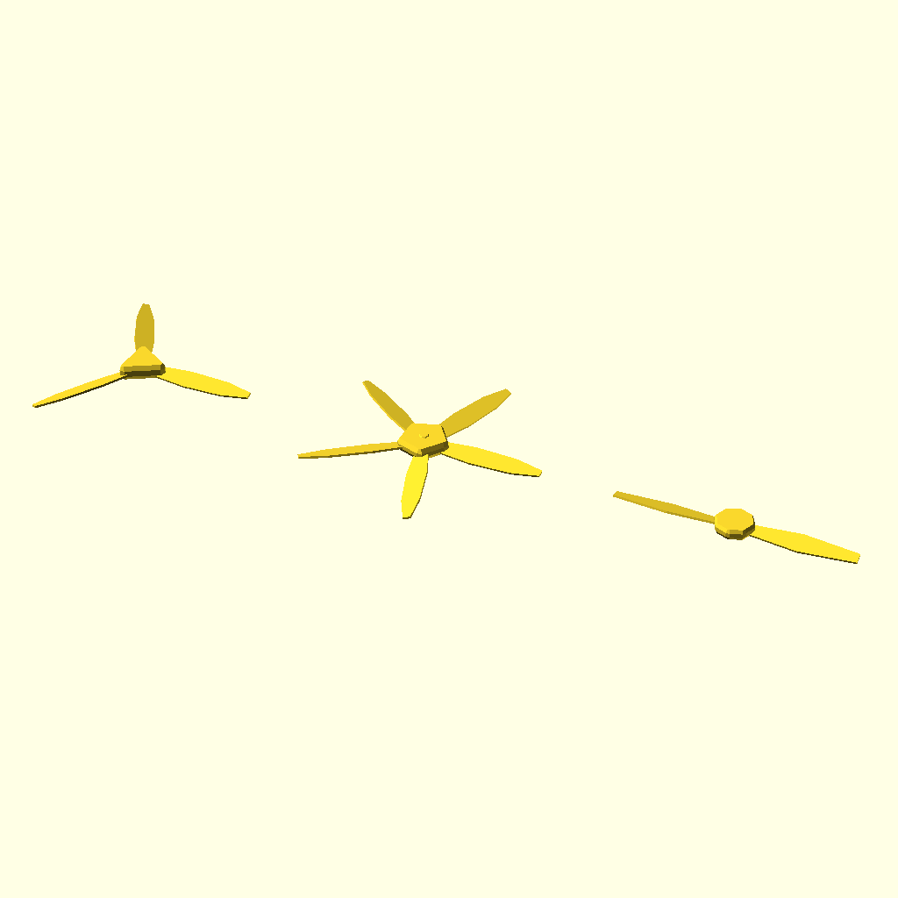

# scadbuild

This allows scad files to be built in batch which will produce a preview **.PNG** and optionally a **.OBJ** and **.STL** output for each.

**Tip** Make sure the development version of Open Scad is installed as it has needed options for exporting.

**Tip** If first time set the source and destination directories. 

## Author
![Kiweed Software]documents/logo_goblin.png)
Dean B. White aka "Hoek67"  **Kiweed Software 2023**

If you like this Software and it saves you time feel free to donate anything as I'm open to improvements. 

## Building

The build is a single project that should build a 64 bit version and executable. 

## Example Scad File "lib_rotor.scad"

    // measure in mm and scale final results
    
    use <utility.scad>  
    
    module lib_rotor
    (
        blades = 3,
        rad = 20, 
        base_h = 6,  
        bl_l = 60, 
        bl_w = 10, 
        bl_angle = 15, 
        blade_segs = 9, 
        detail = 1, 
        cap = 1
    )
    {
        csegs = blades < 3 ? 8 : blades;
        crot =  360.0 / (blade_segs * detail) * .5;
    
        // Draw a single rotor blade
        module draw_blade()
        {
          rotate([bl_angle, 0,0]) 
          translate([bl_l  ,0,0])  
          scale([bl_l, bl_w, 1])   
          linear_extrude(height = 2, center = true)  
          rotate([0,0,crot]) 
          circle(1, $fn = blade_segs * detail);
        }
            
        // draw cap on top if wanted   
        if (cap == 1)
        {
            sphere(r = rad * .5, $fn = 8 * detail);
        }

        // Draw the base
        chamfer(r = rad * 0.25, $fn = 6 * detail)
        {
            cylinder(h = base_h, r = rad, $fn = csegs);
        }
    
        // Draw each blade around the base
        st = 360.0 / blades;
    
        for (i = [0:st:360])
        {
            rotate([0,0, i]) draw_blade();
        }
    }

    // Outputs sample usage ... this is the preview and default .STL .OBJ

    mm2m()
    {
        translate([0, 0, 0]) lib_rotor();
        translate([300, 0, 0]) lib_rotor(blades = 5, base_h = 4);
        translate([600, 0, 0]) lib_rotor(blades = 2, base_h = 4, rad = 15, blade_segs = 6);
    };

